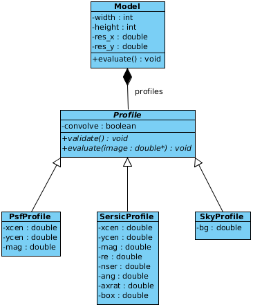

API
===

.. contents:: Contents
   :local:

*libprofit* has two main data types:
the model class (:class:`Model`)
and the base profile class (:class:`Profile`).
We introduce the model first, then the base profile.

As a small reference, see the following class diagram.

Exceptions
----------

.. doxygenclass:: profit::invalid_parameter
   :project: libprofit

Convolvers
----------

.. doxygenclass:: profit::Convolver
   :members: convolve

.. doxygenclass:: profit::BruteForceConvolver

.. doxygenclass:: profit::OpenCLConvolver

.. doxygenclass:: profit::FFTConvolver

Model class
-----------

.. doxygenclass:: profit::Model
   :members:

Profile classes
---------------

.. doxygenclass:: profit::Profile
   :members: convolve, parameter

.. doxygenclass:: profit::RadialProfile
   :members: xcen, ycen, mag, ang, axrat, box, rough, acc, rscale_switch,
             resolution, max_recursions, adjust, rscale_max

.. doxygenclass:: profit::SersicProfile
   :members: re, nser, rescale_flux

.. doxygenclass:: profit::MoffatProfile
   :members: fwhm, con

.. doxygenclass:: profit::FerrerProfile
   :members: rout, a, b

.. doxygenclass:: profit::CoreSersicProfile
   :members: re, rb, nser, a, b

.. doxygenclass:: profit::BrokenExponentialProfile
   :members: h1, h2, rb, a

.. doxygenclass:: profit::KingProfile
   :members: rc, rt, a

.. doxygenclass:: profit::PsfProfile
   :members: xcen, ycen, mag

.. doxygenclass:: profit::SkyProfile
   :members: bg
