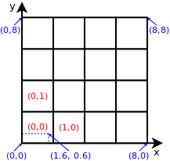

Coordinates
===========

*libprofit* differentiates pixels from actual image coordinates.
Pixels are the individual dots that make up an image,
but from the profiles' point of view
the area where the image is drawn
is a continuum coordinate space.
Profiles use this coordinates to perform their calculations,
as they are more fine grained than individual pixels.

At the model level there are two sets of parameters
that control these two different aspects of the image:

* The ``width`` and ``height`` parameters indicate
  the width and height of the image in *numbers of pixels*.
* The ``scale_x`` and ``scale_y`` parameters indicate
  the horizontal and vertical scale to convert
  the ``width`` and ``height`` parameters into
  image coordinate sizes.

This is shown in the following example:

In the example an image is shown using both their pixels
and their image coordinates.
Each square on the grid represents a pixel on the image,
which are indexed in red.
This image's ``width`` is 4, and its ``height`` is also 4.
Shown in blue on the other hand
are the image coordinates.
The image's ``scale_x`` is 2 and its ``scale_y`` is also 2.
Finally a point is indicated in the image.
Its image coordinates are ``(1.6, 0.6)``,
and is contained within the ``(0,0)`` pixel.

Profiles use image coordinate to perform their calculations
but still need to store only one value per pixel.
For this purpose the quantities ``xbin`` and ``ybin``
are calculated by *libprofit* and stored at the model level,
making them available to all profiles to use.
They indicate the width and height of each pixel
in image coordinates.
In most cases profiles evaluate a pixel's value
using the pixel's center point in image coordinates;
that is, evaluating at ``x = i*xbin + xbin/2``,
where ``i`` is the horizontal pixel index,
and likewise for the vertical coordinate.
In other cases, like in the ``sersic`` profile,
sub-sampling needs to be performed
to achieve an accurate result.
