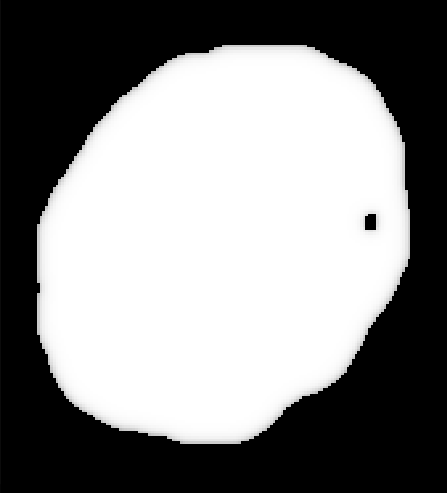
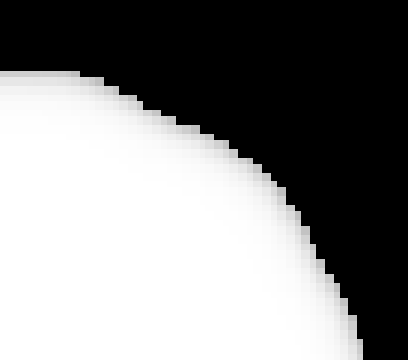
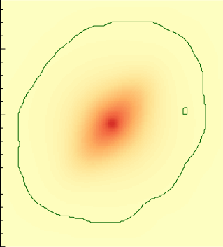
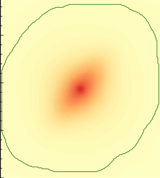

Flux capturing
##############

.. default-domain:: cpp
.. highlight:: cpp
.. namespace:: profit

Flux capturing
refers to the action of fully considering flux
during the convolution process.

What is it
==========

With no convolution taken into account,
profiles already generate the correct luminosity
for each pixel in their respective image.
After that, if there is an extra convolution step
the luminosity in these pixels
gets spread out into their neighbours, and vice-versa.

This is all and well, except when pixels
are close to the edges of the image.
When this happens,
some of their neighbours
are *outside* the image frame.
Because they are outside,
they had not been evaluated by the profiles,
and their fluxes are considered to be 0.
Therefore, when convolution happens for these pixels,
their final luminosity will be less
than what *would have been*
if there was a value calculated
for those pixels outside of the image.

This is better seen graphically.
Here is an example of a plain image
(using a :ref:`sky <profiles.sky>` profile)
after convolution with a simple,
gaussian-like PSF:

In this image,
it is very clear how the pixels
at the boundaries of the image frame
are loosing flux during convolution.
Again, this is because
pixels *outside the image* have no flux,
and therefore don't contribute
to the flux of the pixels within the image
after convolution.

A similar situation happens
when there is a Mask involved:

And a zoom into the top-right corner:

Correct flux capturing is important
to correctly represent observed images,
which *do include* flux coming
from outside the field of view.

How it works
============

As of *libprofit* 1.9.0,
flux capturing is automatically taken into account
without the user needing to worry
about modifying the inputs to a :class:`Model`.
This process takes into account
whether convolution is needed at all,
the size of the PSF,
the original :class:`Mask`,
the finesampling factor set into the :class:`Model`,
and any other factor affecting this computation.

There are two main transformations that take place
when this automatic adjustment happens
internally in the :class:`Model`.
First, if there is a :class:`Mask` involved,
its coverage is expanded.
This coverage expansion is a convolution-like operation,
which is required so the profiles evaluate pixels
outside of the originally-intended area. Like this:

In the figure above,
the left-hand image shows
the original coverage of the :class:`Mask`,
while the right-hand side shows
the *expanded* coverage after taking into account
that the convolution process will require
all the pixels in the expanded area
to have values calculated on them.

The second transformation that needs to happen
is the expansion of the :class:`Model` dimensions.
Like in the first case,
if pixels outside
of the :class:`Model` original image frame
need to be calculated,
then the :class:`Model` dimensions need to be adjusted
so these pixels receive values
during profile evaluation.

Using pre-calculated Masks
==========================

The process described above
happens automatically
without the user having to adjust
any of the inputs of the :class:`Model`.

However, in the case of image fitting,
when we know that the original :class:`Mask`,
PSF, and other inputs will not change
across evaluations of a :class:`Model`,
some work can be pre-calculated.
In particular,
the final form of the :class:`Mask`
can be reused across :class:`Model` evaluations.
This is done in a two-step process:

 * The user first calls :func:`Model::adjust`
   with the intended inputs.
   This results on a pre-calculated :class:`Mask`
   that works for that set of inputs
 * Then, the mask is passed down
   as usual to the :class:`Model`
   via :func:`Model::set_mask`.
   Additionally,
   the :class:`Model` is informed
   that no further adjustment should be done
   on that mask
   via :func:`Model::set_adjust_mask`
   with a ``false`` argument.

Current and previous status
===========================

Until libprofit 1.9.0,
images produced by *libprofit*
failed to correctly capture flux correctly
in scenarios when there was a convolution involved.
The `ProFit <https://github.com/ICRAR/ProFit>`_ R package
implemented this as part of its fitting process though,
but other users would have been lacking this feature.
