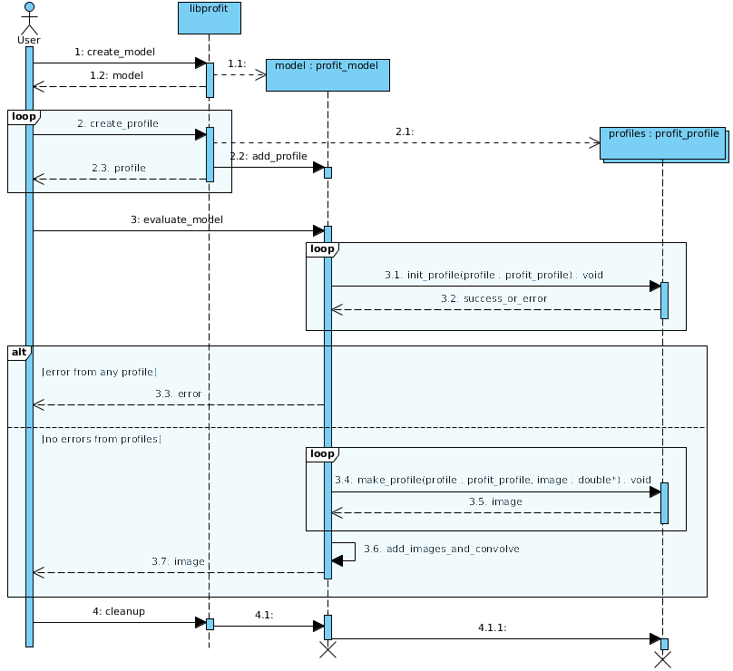

Using *libprofit*
=================

From the command-line
---------------------

*libprofit* ships with a command-line utility ``profit-cli``
that reads the model and profile parameters from the command-line
and generates the corresponding image.
It supports all the profiles supported by *libprofit*,
and can output the resulting image as text values, a binary stream,
or as a simple FITS file.

Run ``profit-cli -h`` for a full description on how to use it,
how to specify profiles and model parameters,
and how to control its output.

Programatically
---------------

As it name implies, *libprofit* also ships a shared library
exposing an API that can be used by any third-party application.
This section gives a brief overview on how to use this API.
For a full reference please refer to :doc:`api`.

.. default-domain:: cpp
.. highlight:: cpp
.. namespace:: profit

At the core of *libprofit* sits :class:`Model`.
This class holds all the information needed to generate an image.
Different profiles (instances of :class:`Profile`)
are appended to the model, which is then evaluated.

The basic usage pattern then is as follows:

#. Add the profit include::

	 #include <profit/profit.h>

#. First obtain a model instance::

	 Model model;

#. Create a profile. For a list of supported names see :doc:`profiles`;
   if you want to support a new profile see :doc:`new_profile`.
   If an unknown name is given an :class:`invalid_parameter` exception will be
   thrown::

	 Profile &sersic_profile = model.add_profile("sersic");

#. Customize your profile.
   To set the different parameters on your profile call
   :member:`Profile::parameter` with the parameter name and value::

	 sersic_profile.parameter("xcen", 34.67);
	 sersic_profile.parameter("ycen", 9.23);
	 sersic_profile.parameter("axrat", 0.345);
	 // ...

   A complete list of parameters can be found on and :doc:`profiles` and
   :doc:`api`.

#. Repeat the previous two steps for all profiles
   you want to include in your model.

#. Evaluate the model simply run::

	 std::vector<double> image = model.evaluate();

#. If there are have been errors
   while generating the image
   an :class:`invalid_parameter` exception will be thrown by the code,
   so users might want to use a ``try/catch`` statement
   to identify these situations::

	 try {
	     std::vector<double> image = model.evaluate();
	 } catch (invalid_parameter &e) {
	     cerr << "Oops! There was an error evaluating the model: " << e.what() << endl;
	 }

#. When the model is destroyed the underlying profiles are destroyed as well.

To illustrate this process, refer to the following figure:

